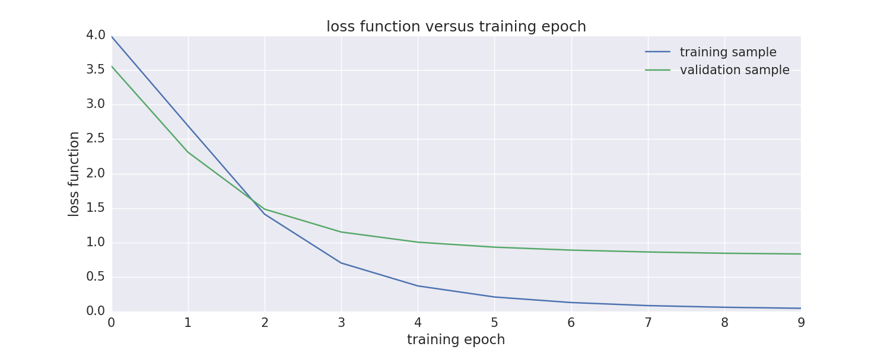
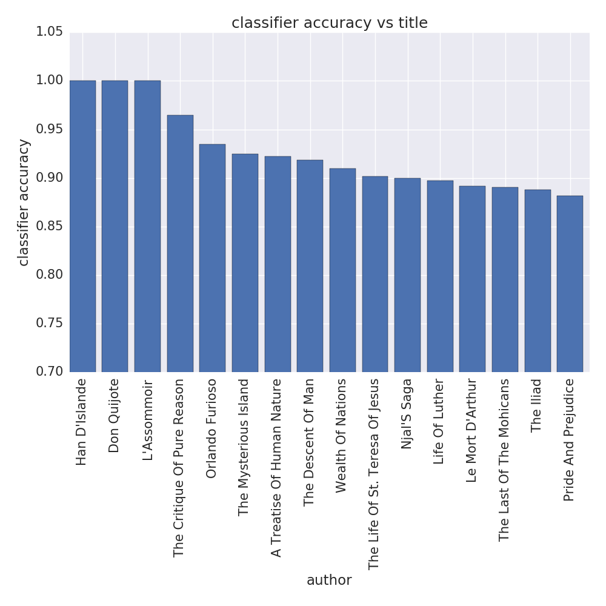
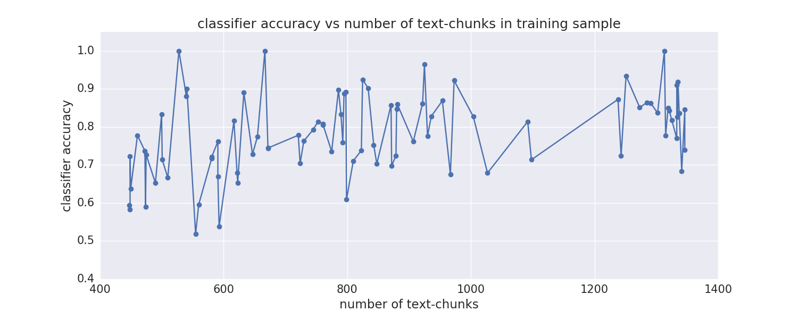

# tf-text-classification-demo

by Joe Hahn, 
jmh.datasciences@gmail.com, 
16 January 2018 
git branch=master

### Intro:

This demo uses an LSTM neural network for text classification. Begin by downloading about
90 books from Project Gutenberg having titles like Dracula, Moby Dick, Wuthering Heights,
etc, with these books then exploded into about one hundred thousand chunks of text
that are each 100 words long. Each text-chunk is then vectorized in a way that preserves
word order, so note that a bag-of-words approach is NOT used here.
The demo then gathers these text-chunks into training and
testing samples, and then trains a long short term memory (LSTM) neural
network to predict the authors of the testing text-chunks. LSTM is useful
when making predictions from ordered data such as text, and is why it is used here.
Model accuracy is then assessed.

### Setup:

This model is executed on a gpu-ready g2.2xlarge instance in the Amazon cloud using the Bitfusion
Tensorflow AMI, and this section details how to launch that instance in the AWS cloud and
prep the input data. But if uninterested in such details, skip
ahead to the _Execute_ section where results are also presented.

1 Launch a g2.2xl EC2 instance in AWS using these settings:

    EC2 > launch instance > Community AMIs
    search for 'Bitfusion Ubuntu TensorFlow' > g2.2xlarge
    set tag Name=dl
    security group settings:
        set SSH and TCP entries to have Source=My IP         #this permits ssh and jupyter
        add custom TCP rule, port=6006, Source=My IP         #this permits tensorboard
    create keypair with name=tf_demo
    Launch

this instance provides 26 ECUs, 8 vCPUs, 2.6 GHz, Intel Xeon E5-2670, 15 Gb memory, 
10 Gb SSD Storage at a cost of $0.74/hr.

2 The above also creates private ssh key named tf_demo.pem that should be stored in the 'private'
folder with these permissions:

    chmod 400 private/tf_demo.pem

3 Obtain the instance's public IP address from the EC2 console, and then ssh into the instance:

    ssh -i private/tf_demo.pem ubuntu@ec2-52-11-206-236.us-west-2.compute.amazonaws.com

4 Clone this repo to the instance:

    git clone https://github.com/joehahn/tf-text-classification-demo.git
    cd dl

5 Install additional python library:

    sudo pip install seaborn

6 Download a CD of 600 Project Gutenberg books from a mirror (since Gutenberg
often blocks downloads to an EC2 instance), then mount:

    wget http://mirrors.pglaf.org/gutenberg-iso/PG2003-08.ISO
    mkdir iso
    sudo mount -ro loop PG2003-08.ISO iso
    ls -R iso

6 Parse the input books:

    ./parse_texts.py

this admittedly unsophisticated script attempts to extract the author and title from each
Gutenberg book (with success ~50% of the time). For each book having a known author and
title, the script explodes the book into 100-word-long chunks of text, and preserves
text-chunks from those books that are at least 750 chunks long. If however a book is longer
than 2200 chunks, only a random selection of 2200 chunks is preserved. Also if an author
has multiple books in this sample, only the longest book is preserved. This results in a
sample of about 100,000 text-records that are extracted from 88 distinct books, with
each book contributing anywhere between 750 and 2200 records each. So the input sample
does suffer from a modest degree of class imbalance, and that class imbalance is not
corrected here

9 Now prep Jupyter by changing this line in ~/.jupyter/jupyter_notebook_config.py:

    c.NotebookApp.notebook_dir = u'/home/ubuntu/tf-text-classification-demo'

which will allow Jupyter to navigate to this repo.

10 Kill the jupyter processes that was originally launched by this bitfusion AMI:

    ps -aux | grep jupyter
    sudo kill -9 XXXX

since Bitfusion's Jupyter wont let you navigate to this repo.

11 Stash the instance-id:

    echo $(ec2metadata --instance-id) > instance-id
    cat instance-id

12 Then start jupyter:

    jupyter notebook

13 and browse jupyter at public_IP:8888 and log in with password=instance-id

    ec2-52-11-206-236.us-west-2.compute.amazonaws.com:8888

14 Navigate to the tf-text-classification.ipynb Jupyter notebook and click Kernel > Run to
read the text-chunks and to train the LSTM model on that data. Execution time
is about 40 minutes.

15 Monitor GPU usage:

    watch -n0.1 nvidia-smi

16 Start tensorboard via

    tensorboard --logdir=tf_logs/

17 And then browse the tensorboard UI at

    ec2-52-11-206-236.us-west-2.compute.amazonaws.com:6006

which is useful when tuning the neural network parameters.

### Execute

The notebook reads the 100-word-long chunks of text that parse_texts.py extracted
from 88 books downloaded from the Gutenberg Project. The notebook then splits
that data into test, train, and validation samples. It then vectorizes these chunks of
text in a way that preserves word order, and then fits the following
LSTM model on the training data:

The Tensorboard UI also provides this interesting graph of the resulting neural network:

The notebook takes about 40 minutes to train the nextwork, and then plots the LSTM model classifier's
accuracy vs training epoch:

and loss function versus training epoch:

Note that the model claims 100% accuracy when predicting the authors of the
training text-chunks, yet it only achieves 80% accuracy when predicting the authors
of the validation text-chunks, so this model suffers from some degree of
overfitting despite several hours of tweaking and rerunning.
The LSTM model is then used to predict the authors of those text-chunks that were
set aside for testing, and the model accuracy versus author is:

The following replots the above but versus title rather than author, with only
the leftmost aka high-accuracy end being shown.
Note that this model can predict with near 100% accuracy the authors of those text-chunks 
that were pulled from the one Spanish and two French books in this sample.

The plot below shows results for the rightmost lower-accuracy books; this classifier
appears to be less somewhat successful at identifying the authors of non-fiction text-chunks:

The most problematic book, Junior Classics by 'Various', is actually a collection of stories by
about 50 different authors. Despite the many opportunity for confusion, this classifier
was still able to correctly flag the author as 'Various' for about 50% of text-chunks pulled
from this particular book. 

Lastly, this plot shows the classifier's accuracy versus the number of text-chunks, from 400
to 1400, that were pulled from the 88 different books and used to train this classifier:

Evidently this model is quite insensitive to the training sample's class imbalance, which for
some books is a factor of 3.
